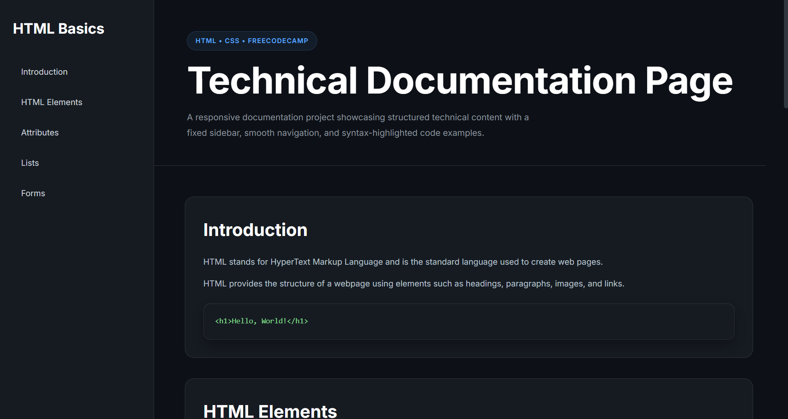
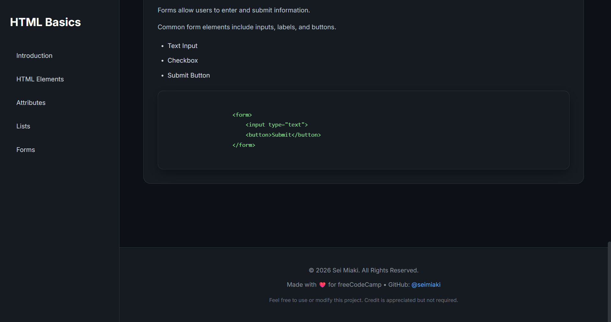

<h1 align="center">📄 Technical Documentation Page</h1>

<p align="center"> A clean and responsive Technical Documentation Page built with <strong>HTML5</strong> and <strong>CSS3</strong> for the freeCodeCamp Technical Documentation Page project.</p>

<p align="center">     </p>

## 📸 Preview

<p align="center">  </p>

## ✨ Features

- Fixed sidebar navigation
- Responsive documentation layout
- Structured technical content
- Smooth scrolling navigation
- Semantic HTML structure
- Clean, readable, and beginner-friendly code

## 🛠️ Tech Stack

<p>
  
</p>

## 🚀 Running Locally

1. Clone the repository.

```bash
git clone https://github.com/seimiaki/fcc-responsive-web-design.git
```

2. Navigate to the project folder.

```bash
cd fcc-responsive-web-design/technical-documentation-page
```

3. Open `index.html` in your preferred web browser.

No installation, build tools, or additional dependencies are required.


## 📜 License

This project is licensed under the **MIT License**. See the [LICENSE](../LICENSE) file for details

---
If you found this project helpful, consider giving the repository a ⭐.